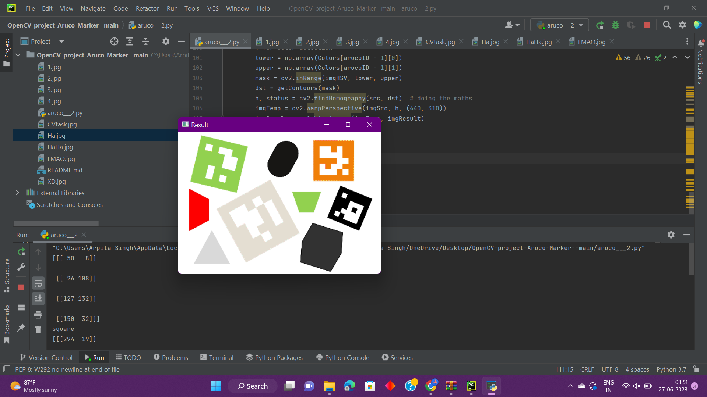

# OpenCV-project-Aruco-Marker-

With the help of this OpenCV project, we have autonomously put ArUco markers on square boxes. 

ArUco markers are binary square fiducial markers that can be used for camera pose estimation. Their main benefit is that their detection is robust, fast, and straightforward.

### PROBLEM STATEMENT
 
- Python code for finding square boxes in an image

- Place aruco markers exactly overlapping on it with the following rules.

- Box Colour Marker ID Green 1 Orange 2 Black 3 Pink-Peach 4

- The aruco markers are placed precisely on the squares only, even the orientation of the square.

Markers are in the given folder (but not id specified)

Folder: https://drive.google.com/drive/folders/1ZqsNvyVSxA2i6jjq54mJCGuVJ-6TskMt?usp=sharing

 

 

> _Future Modification: autonomously put ArUco markers on square boxes in real-time (beneficial at industry level )  :)_
